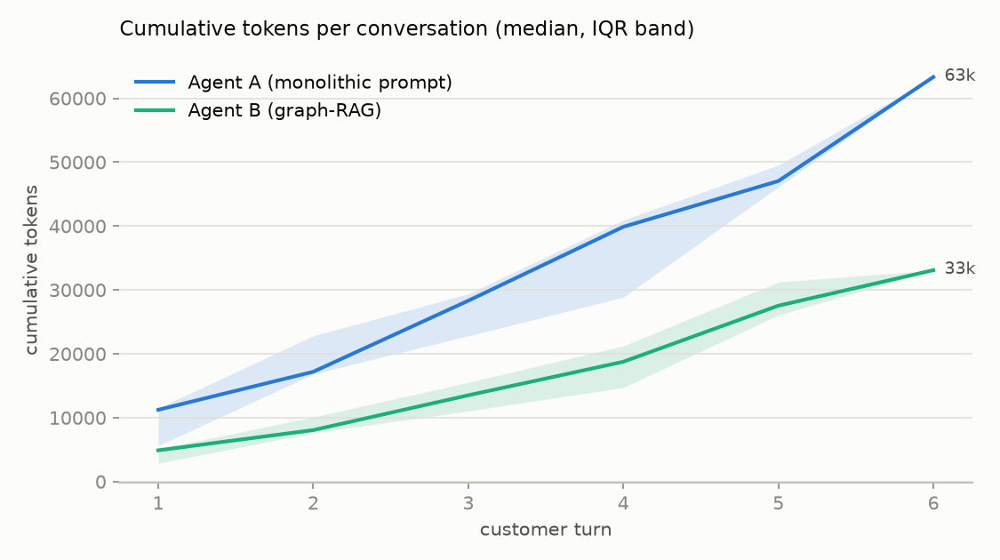
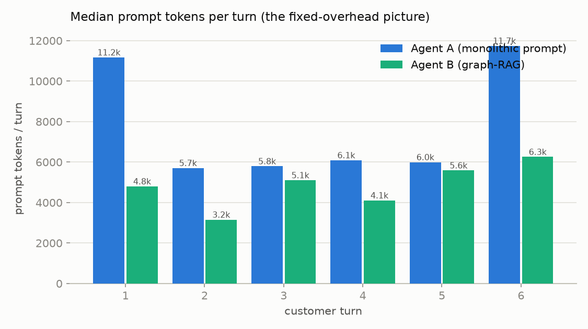
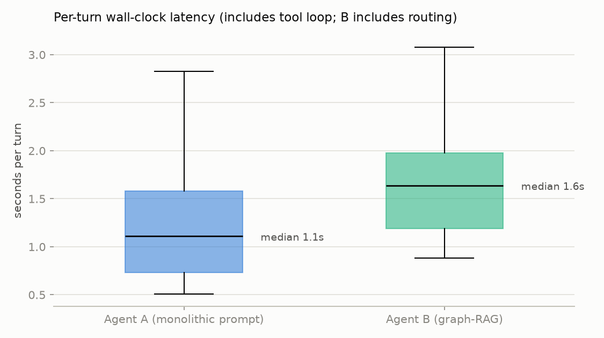
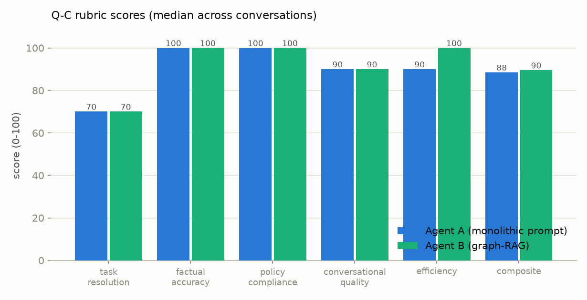
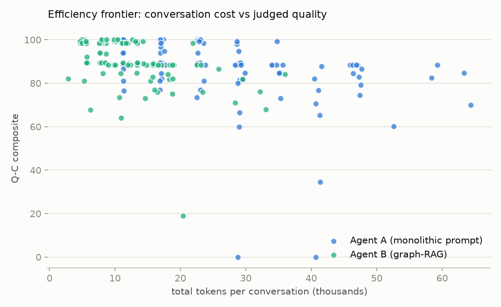

# Graph-RAG vs Monolithic Prompt — Results Report

Generated by `analysis/visualize.py` on 2026-07-05. Setup: PLAN.md; parity evidence:
`results/parity_matrix.csv` + `results/semantic_parity_triage.md`. Both agents ran
`mistral/mistral-small-2506` (temp 0.3); Agent B's router: `mistral/mistral-small-2506` (billed to B);
judge: `mistral/mistral-small-2506`, blind, double-judged, per-dimension medians.

## Headline numbers

| Metric | Agent A (monolithic) | Agent B (graph-RAG) |
|---|---|---|
| Conversations completed | 102 | 102 |
| Median tokens / conversation | 23,361 | 11,008 (**53% less**) |
| Median prompt tokens / turn | 5,870 | 4,800 |
| Median / p90 turn latency | 1.1s / 2.2s | 1.6s / 2.7s |
| Q-C composite (median) | 88 | 90 |
| Resolution rate (ended satisfied) | 59% | 64% |
| Escalated to human (ticket) | 19% | 25% |

Agent B's routing overhead: **20.8%** of its total tokens (honestly billed).

## Figures

## Hypotheses (PLAN.md §1.3)

- **H1 (tokens):** SUPPORTED — 53% median token reduction (target ≥40%)
- **H2 (latency):** NOT MET — B slower per turn (routing adds a serial call)
- **H3 (quality):** SUPPORTED — B composite 90 ≥ A 88
- **H4 (degradation):** INCONCLUSIVE at ≤6-turn conversations — see §Discussion.

## Discussion

### The core trade: half the tokens, at +0.5s a turn
Across 204 conversations the graph-RAG architecture halved conversation cost (2.77M vs
1.28M total tokens; −53% at the median) **with the router's 20.8% overhead already
charged to it**, while judged quality held (B 89.5 vs A 88.5 composite median) and
resolution rate ticked up (64% vs 59%). The price is wall-clock: the serial router call
makes B ~0.5s/turn slower (1.64s vs 1.11s median). Fig 2 shows why the token result is
structural, not incidental: A re-pays its full manual on every generation call
(5.9–11.7k prompt tokens/turn, spiking whenever the tool loop needs multiple calls),
while B's per-turn cost stays near ~4–6k and is dominated by history, not instructions.

### Where the graph wins: edge cases and escalation discipline
The largest quality gaps all favor B on **policy-boundary scenarios**:
- **S-V2-02 (day-31 return), run 1** — A computed the dates correctly and still ruled
  the return *eligible*, offering refund options (composite **34.5**); B stated
  "31 days > 30" and correctly declined with the human-review path (**88.5**). The
  graph makes the deny-path a node with no return-initiation authority, so the model
  cannot drift past it.
- **S-V6-02 (two-strikes handoff), run 1** — A never offered the proactive human
  handoff and its ticket call failed (**0.0**); B escalated per the node instruction
  (**88.5**).
- A also showed classic monolithic-prompt **cross-contamination**: in smoke testing it
  told a customer SUMMER20 requires a $150 minimum — VIP25's threshold from the same
  prompt section. B, seeing only the focused promo node, answered correctly.
- B escalates more overall (25% vs 19%); the escalated transcripts are overwhelmingly
  *correct* escalations (exception pleas, damaged final-sale approvals), consistent
  with the graph making handoff a first-class, always-routable node.

### Where the monolith wins: fluid pivots
A's biggest wins (S-V2-03 run 2, S-M-01 run 2, S-M-02 run 2) share a shape: multi-step
or multi-intent conversations where B's turn-scoped node view caused it to under-use
already-provided information or lose a thread across a router pivot, costing task
resolution points. The router is right on discrete jumps (12/12 probes), but a
conversation that interleaves two intents within single messages still suits a model
that holds the whole manual at once. This is the real cost of scoping context per turn.

### H4 (degradation) — inconclusive at this scale
Both agents score lower on longer conversations (A −6.5, B −13.7 composite from ≤3-turn
to ≥5-turn conversations), but B's long-conversation sample is 6 conversations and the
cap was ~6 turns — far short of the 15–30-turn regime where monolithic context bloat
should bite hardest. H4 needs a dedicated long-conversation stress test.

### Threats to validity
1. **Same-model judge** (Mistral-small judging Mistral-small outputs). Defensible here
   because both arms share the model, so self-preference cancels in the delta; the
   gpt-oss-120b cross-check on 12 conversations agrees on direction (B 96.2 vs A 95.2)
   but per-conversation correlation is weak (r = 0.33) and the Mistral judge runs ~7
   points harsher — absolute scores must not be compared across judges.
2. **Single model family** for agents; the effect should shrink for models with
   stronger long-context discipline and grow for weaker ones.
3. **Simulated customers** (also Mistral-small) end conversations by scripted criteria;
   the 50 max-turns endings are conversations the sim didn't consider closed — these
   depress both agents' resolution rates equally.
4. **Latency** was measured against live provider infrastructure (single region, one
   session); it includes tool-loop calls and, for B, the serial router. A production
   system could overlap routing with speculative generation or cache per-node routing,
   attacking most of B's 0.5s penalty; nothing similar can attack A's token overhead.
5. Both prompts received documented, bounded hardening iterations (3 each — see
   transcript history); the parity audits (tag + semantic, triaged in
   `results/semantic_parity_triage.md`) gate against content asymmetry.

### Conclusions
For this workflow class, Graph-RAG delivers its headline promise — **~53% compute
reduction at equal-or-better judged quality, with markedly better policy fidelity on
edge cases** — in exchange for ~0.5s/turn of routing latency and a residual weakness on
tightly interleaved multi-intent turns. Where token cost, policy compliance, or
long-horizon context growth dominate (high-volume support; voice agents with strict
context budgets), the graph architecture is the better default. Where short
conversations and sub-second responsiveness dominate, the monolithic prompt remains
competitive.

### Future work
Voice pipeline (token savings compound with TTS/ASR latency budgets); 15–30-turn
degradation stress test (H4); parallel/speculative routing to eliminate the latency
penalty; embedding-based routing for graphs too large for menu prompts; replication on
a second model family and with 3+ runs per scenario.
