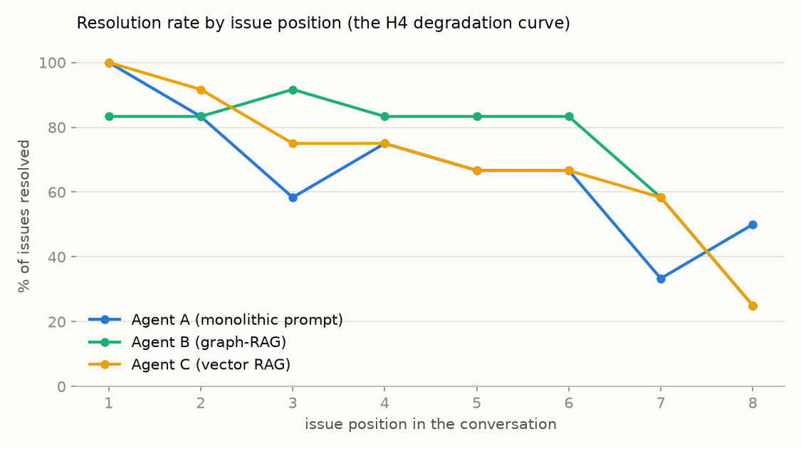
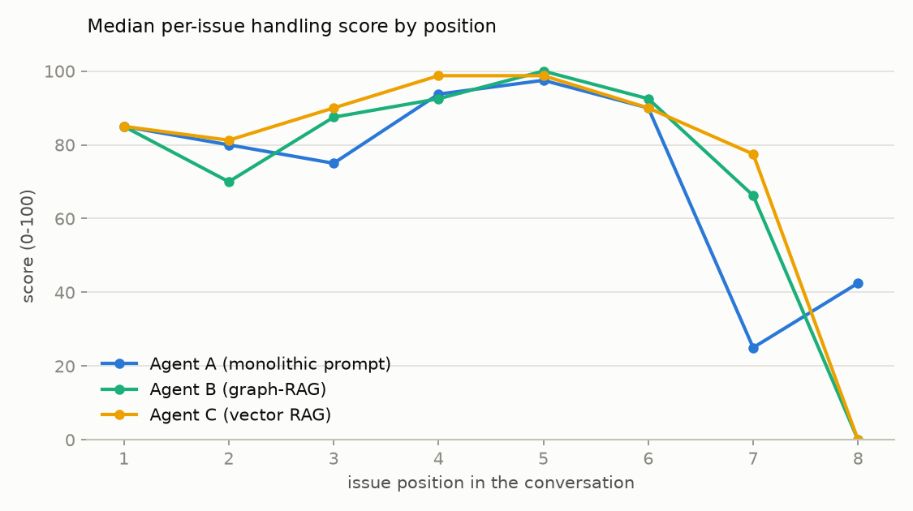
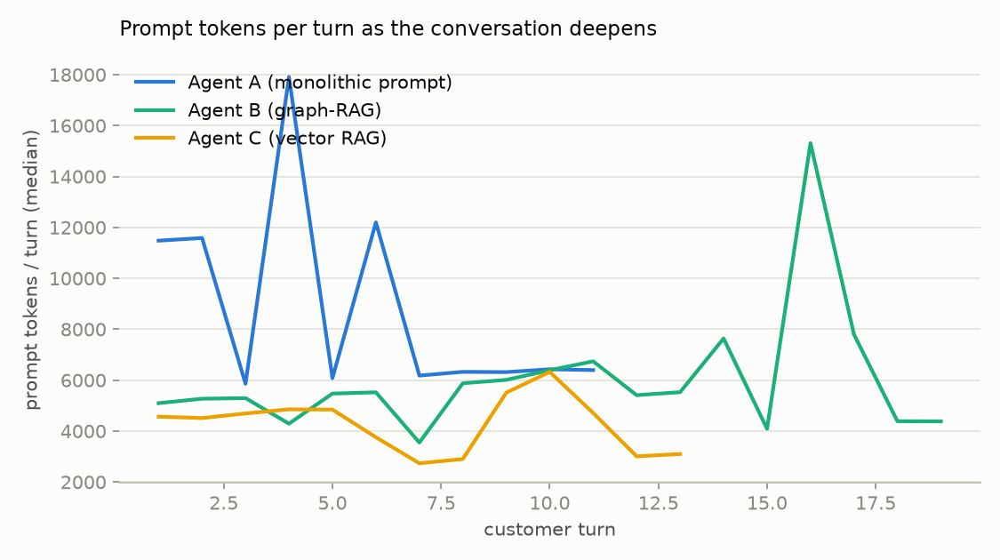
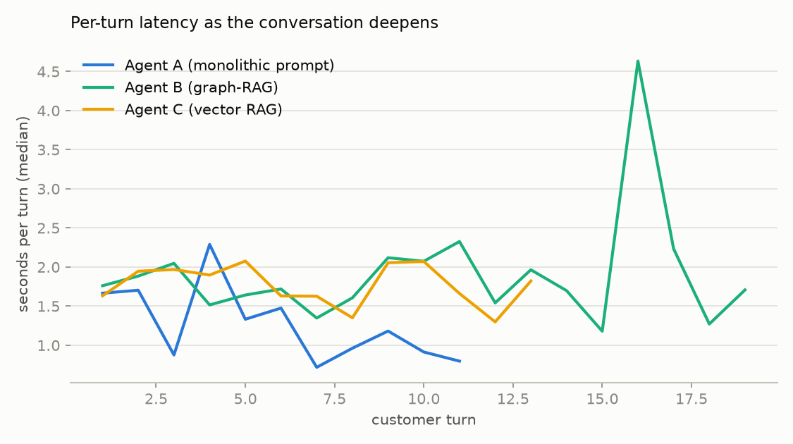

# H4 Stress Test — Long-Conversation Degradation (marathon scenarios)

6 marathon scenarios (7-8 sequential issues each, up to 26 customer turns) × 3 agents × 2 runs = 36 conversations. Per-goal blind judging (deduction rubric, double-judged, resolved = strict AND). Data: `results/stress/`.

| Agent | convs | median turns | median tokens/conv | goals resolved | early res. (1-3) | late res. (6+) | early→late Δ | early score | late score |
|---|---|---|---|---|---|---|---|---|---|
| Agent A (monolithic prompt) | 12 | 9 | 86,946 | 68% | 81% | 50% | **-31pp** | 85 | 68 |
| Agent B (graph-RAG) | 12 | 8 | 41,026 | 78% | 86% | 64% | **-22pp** | 85 | 84 |
| Agent C (vector RAG) | 12 | 9 | 37,656 | 74% | 89% | 57% | **-32pp** | 85 | 81 |

## Reading

**H4 is SUPPORTED (A vs B), with a mechanism refinement the short matrix couldn't see.**

1. **Everyone degrades with depth** — no architecture is immune: early→late resolution
   drops 31pp (A), 22pp (B), 32pp (C).
2. **B degrades least, and differently.** B holds a flat ~83% plateau through positions
   1–6 and its per-issue handling score barely moves (85 early → 84 late). A slides
   steadily (100% → 33–50%; score 85 → 68). C tracks A's slope (→ 25–58%; 85 → 81)
   despite having A-like *focus* problems and B-like *token* costs.
3. **The mechanism is instruction relevance, not context volume.** C carries roughly
   B's token load (38k vs 41k median/conversation) yet degrades like A (−32pp vs −31pp).
   So degradation is NOT primarily caused by raw context growth — it comes from the
   instruction signal drowning at depth. B resists because the router re-supplies the
   one relevant instruction packet fresh every turn, regardless of how deep the
   conversation is; A's manual recedes into an ever-longer history, and C's retrieval
   quality decays as the query context muddies.
4. **The cost story compounds at depth.** Marathon conversations cost A a median
   **86,946 tokens** vs B 41,026 and C 37,656 — a 2.1× premium, worse than the 2.0×
   seen at short lengths, and headed the wrong way as conversations lengthen
   (figS3: A's per-turn cost climbs ~11k→13k+ while B/C stay ~4–7k).

**Caveats:** n = 12 conversations/agent (72–96 goal observations per agent, but only
~4–8 at positions 7–8, so the tail points are noisy — A's position-8 uptick is small-n
noise); the judge reads the whole conversation, so a late-issue score isn't fully
independent of earlier chaos; single model family; conversations reached ~8–15 turns
(sim resolves issues efficiently) rather than the full 26-turn ceiling.

**Verdict line for the main report:** H4 SUPPORTED — the monolithic architecture
degrades fastest on both resolution (−31pp early→late) and handling quality (85→68);
graph-RAG degrades least (−22pp, 85→84) because per-turn instruction re-focusing is
depth-invariant; vector RAG shows that low token cost alone does not buy degradation
resistance (−32pp).